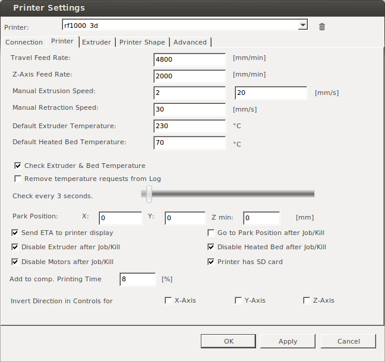
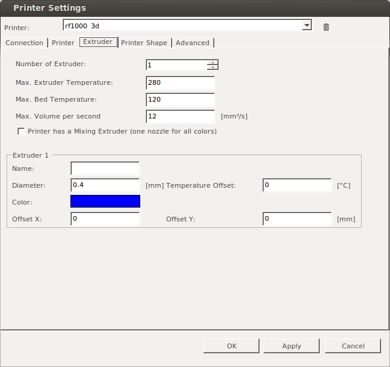
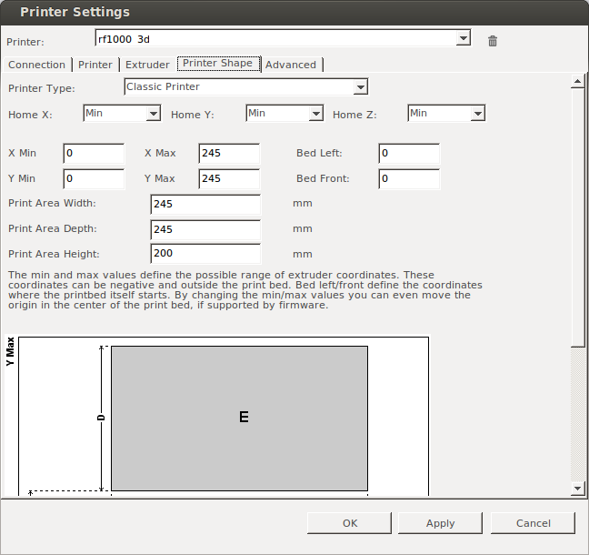
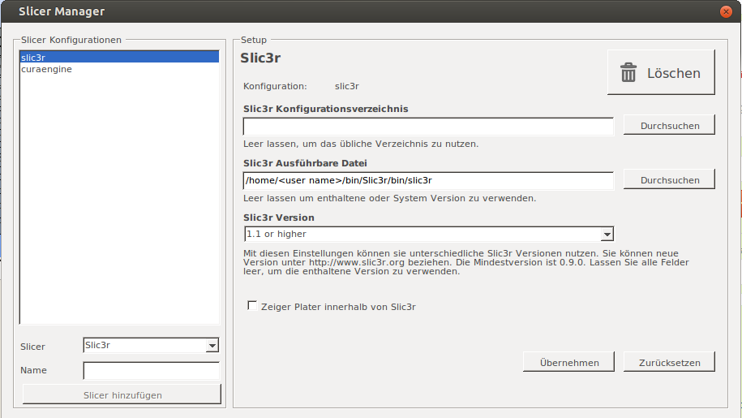
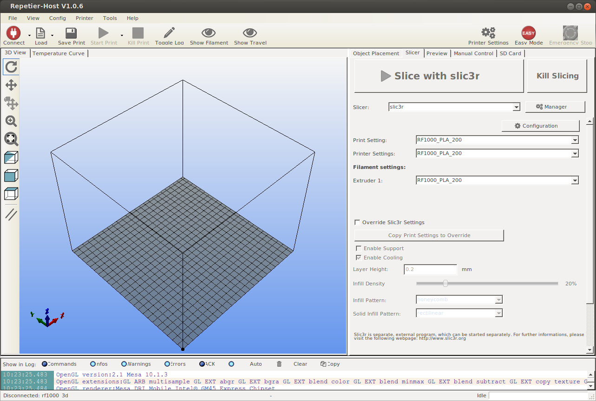

# RF1000_basic_settings
Renkforce RF1000 HowTo and Basic Settings

## Anleitung zum 3D Druck auf Renkforce RF1000

### Vorbereitungen
1. [Download](http://www.repetier.com/download/) Repetier Host Software.
2. Installation Repetier Host Software, für Windows gibt es einen Installer, für Linux Datei nach `/home/<user name>/bin/` downloaden und folgende Befehle ausführen:  
```
    tar -xzf repetierHostLinux_1_03.tgz
    cd RepetierHost
    sh configureFirst.sh
```
3. Konfiguration Repetier Host Software, dazu Programm  Repetier Host öffnen und auf den Button Printer Settings klicken. Dort dann die entsprechenden Reiter nach den Screenshots einstellen:
<p> Reiter "Printer":</p>
<p></p>
<p> Reiter "Extruder":</p>
<p></p>
<p> Reiter "Printer Shape":</p>
<p></p>
4. [Download](http://slic3r.org/download/) Slicer Software: "Slic3r"
5. Installation Slic3r Software, dazu das Archiv (zip, tar.gz) entpacken. Bei Linux am besten nach `/home/<user name>/bin/`
6. Konfiguration Slic3r Software, dazu Programm  Repetier Host öffnen, den Reiter "Slicer" wählen und auf den Button "Manager" klicken. Das Fenster "Slicer Manager" öffnet sich, dort auf den Button "Slicer hinzufügen" klickenund dann laut folgendem Screenshot einstellen:
<p>Fenster "Slicer Manager":</p>
<p></p>
<<<<<<< HEAD
7. Fenster "Slicer Manager" schliessen und auf Button "Configuration" klicken. Dann öffnet sich das Fenster "Slic3r", dort auf File->Load Config Bundle gehen und dort 
[RF1000_PLA_200.ini](https://github.com/iki-wgt/RF1000_basic_settings/releases/download/0.3/RF1000_PLA_200.ini) laden.
8. Geladene Config speichern, dazu muss jeder Reiter 2,3,4 (Print Settings, Filament Settings, Printer Settings) angewählt werden und dort mit dem Diskettensymbol gespeichert werden.

##
=======
7. Fenster "Slicer Manager" schliessen, dann im "Slicer:" dropdown Menü "slic3er" auswählen und auf Button "Configuration" klicken. Dann öffnet sich das Fenster "Slic3r" und der "Configuration Assistant", den Assistenten schliessen, dann im "Slic3r" Fenster auf File->Load Config gehen und dort 
[RF1000_PLA_200.ini](https://github.com/iki-wgt/RF1000_basic_settings/releases/download/0.2/RF1000_PLA_200.ini) laden.
8. Geladene Config speichern, dazu müssen die Reiter 2,3,4 (Print Settings, Filament Settings, Printer Settings) angewählt werden und dort mit dem Diskettensymbol gespeichert werden (Falls das Diskettensymbol nicht sichtbar ist, wird an dessen stelle ein kleines blaues Quadrat angezeigt.
>>>>>>> cfcf6b587fbc4ff6c607a14d4cf1a6b4cd333441

### Slicing
Vor Betätigung des Buttons "Slice with slic3r" ist darauf zu achten, dass für Print-, Printer Setttings und Extruder das zuvor gespeicherte config File ausgewählt ist.
<p></p>
